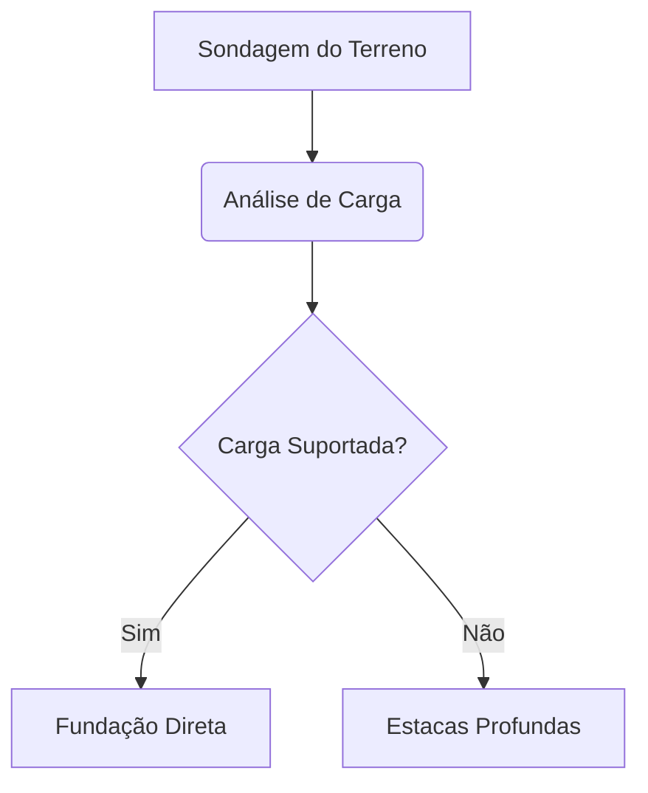

# Cover
Everton

# MEMORIAL TÉCNICO DE ENGENHARIA
## 1. Escopo Estrutural do Projeto: Generic project

O cálculo de dimensionamento dos pilares de sustentação, no empreendimento HERE, foi executado utilizando o critério de esbeltez e tensão admissível do material, conforme a formulação clássica (35.0):

$$ \sigma = \frac{P}{A} \pm \frac{M}{W} $$

Abaixo, apresentamos o diagrama lógico que descreve o fluxo de validação da infraestrutura da obra de Infraestrutura:

# Annex
Generic project