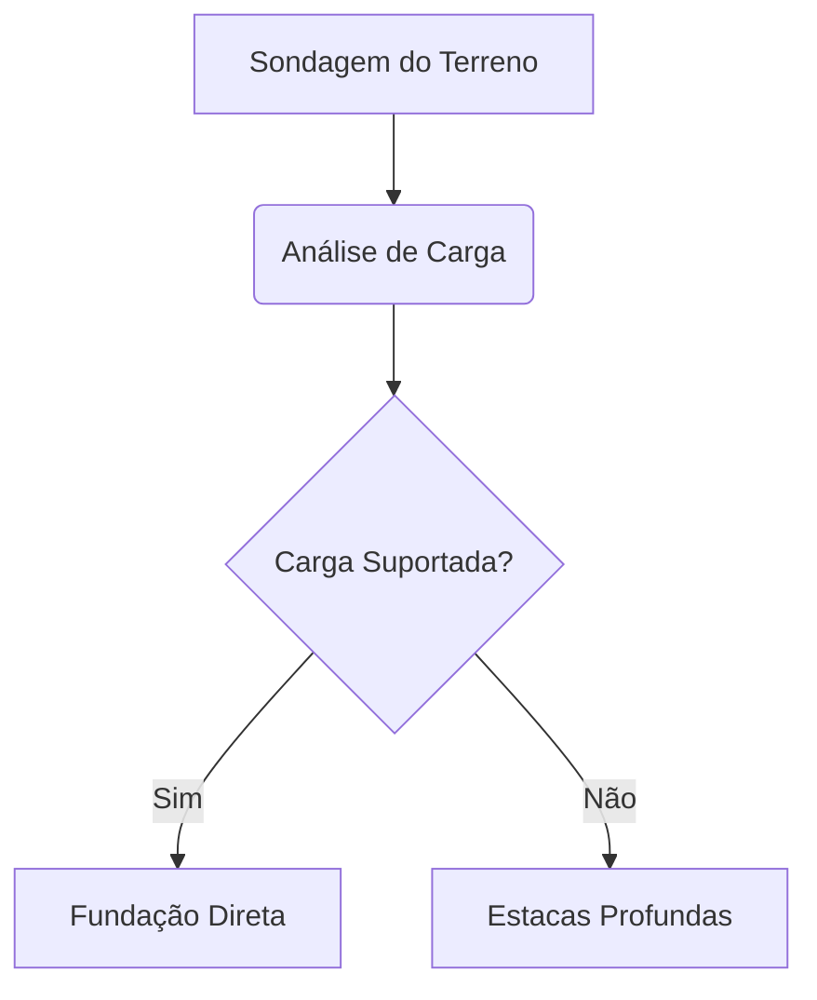

# **Título do Projeto**

@include('logo.png')

## MEMORIAL TÉCNICO DE ENGENHARIA

## 1. Escopo Estrutural do Projeto de **Estruturas**

O cálculo de dimensionamento dos pilares de sustentação foi executado utilizando o critério de esbeltez e tensão admissível do material, conforme a formulação clássica:

$$
\sigma = \frac{P}{A} \pm \frac{M}{W}
$$

Abaixo, apresentamos o diagrama lógico que descreve o fluxo de validação da infraestrutura da obra:

@include(components/structural.docx)
